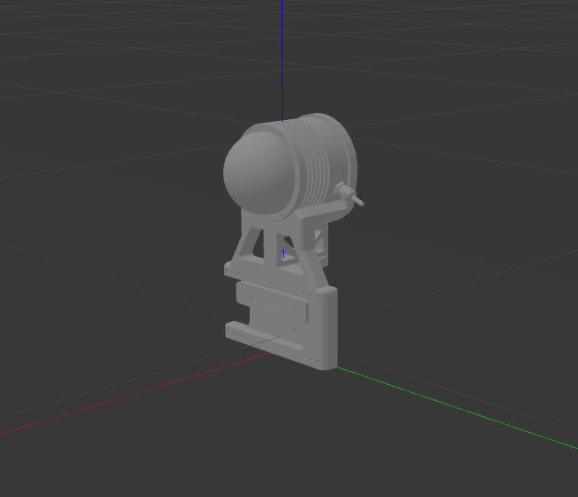
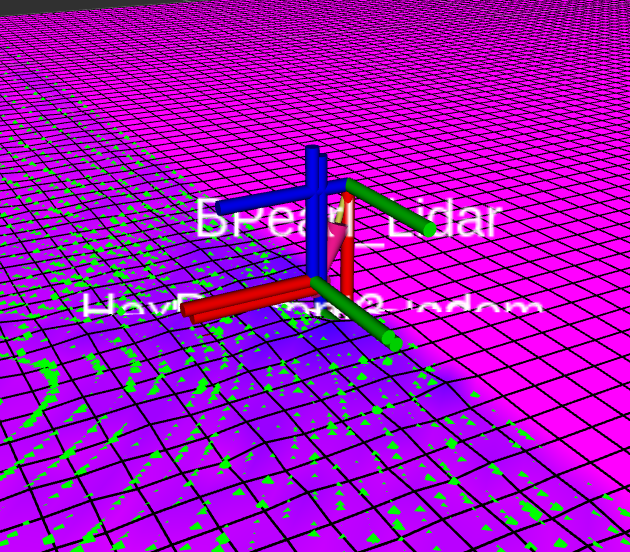

# HexapodElevationMapping

[English](README.md) | [中文](README_CN.md)

**Sensor Module & Elevation mapping bundle** for Robot both in simulation and real world.

TODO:
- Add namespace option for sensor module

---

## Sensor Modules

### HexPercept1

<div style="display:flex; justify-content:center;">
    
    
</div>

HexPercept1 use **T265 as Inertial Measurement Unit (IMU)** and **Velodyne VLP-16 Lidar as range sensor**.

### HexPercept2

<div style="display:flex; justify-content:center;">
    
    
</div>

HexPercept2 use **T265 as Inertial Measurement Unit (IMU)** and **RoboSense BPearl as range sensor**.

### HexPercept3

<div style="display:flex; justify-content:center;">
    
    
</div>

HexPercept3 use **T265 as Inertial Measurement Unit (IMU)** and **RoboSense BPearl & D435i(not equipped) as range sensor**.

---

## Get Started

### Environment Setup

First creat a ros workspace and clone this repository.

```bash
cd <your_workspace>/src
git clone --recursive https://github.com/MasterYip/HexapodElevationMapping
# or `git clone --recursive https://github.com/HITSME-HexLab/HexapodElevationMapping`
```

Install dependencies.

```bash
sudo apt install ros-$ROS_DISTRO-realsense2-camera ros-noetic-realsense2-description libpcap-dev
```

Catkin make.

```bash
cd ../../
catkin build hexapod_elevation_mapping -DCMAKE_BUILD_TYPE=Release
source devel/setup.bash
```

### Launch Demos

Choose a sensor module and launch the demo.

```xml
<!-- HexPercept1 / HexPercept2 / HexPercept3 -->
<arg name="module_name" default="HexPercept1" />
```

```bash
roslaunch hexapod_elevation_mapping demos.launch
```

---

## User Guide

### Understanding modules & module interface

In ros package `hexapod_elevation_mapping`, Sensor modules are defined in `model/modules` folder. Each module has its own launch file and configuration file. In consideration of **module reuseability**, we try to define a **simple module interface**.

There are several files in `model/modules/<module_name>` folder:

- module.launch: Manage parameters & launch nodes for each sensor module both in simulation and real world.
- example.xacro: Used by demo.launch to spawn only the module in gazebo.
- <module_name>.xacro: Xacro macro file for the module.
- <module_name>.rviz: RViz configuration file for the module.
- 3D model files: 3D model files for the module.

For each module, the **input interface** is defined in `module.launch`:

```xml
<arg name="module_name" default="HexPercept1"/>
<arg name="sim" default="true"/>
<arg name="module_installation_tf" default="0 0 0 0 0 0"/>
<arg name="base_frame_name" default="base_link"/>
<arg name="world_frame_name" default="world"/>
```

- module_name: Name of the module.
- sim: Whether the module is in simulation or real world.
- module_installation_tf: Transformation from the base_link to module.
- base_frame_name: Name of the base tf frame.
- world_frame_name: Name of the world tf frame. Module odom will publish a tf from `world` to `base`

The **output** is the point cloud topic that the elevation mapping node will subscribe to. The topic name is defined in `module.launch`

### Deploy Modules on robots

1. Use <module_name>.xacro to define the module in your robot xacro file. You can use `example.xacro` as a template.
2. Make a copy of `demos.launch` and modify the relevant parameters, make sure the frame names and topic names are correct.
3. Launch your robot (gazebo or real world).
4. Launch the module launch file you have just created.

---

### Notations

#### RS-BPearl Lidar IP config

When using default RS-Bpearl firmware:

- Host IP: 192.168.1.102
- Net Mask: 255.255.255.0

#### [elevation_mapping readme](elevation_mapping/README.md) correction

- **`robot_base_frame_id`** (string, default: "/robot")

  **(not base_frame_id)**

  The id of the robot base tf frame.

- **`sensor_processor/cutoff_min_depth`**, **`sensor_processor/cutoff_max_depth`** (double, default: min, max of numeric_limits<double>)

  **(not sensor_cutoff_min_depth, sensor_cutoff_max_depth)**

  The minimum and maximum values for the length of the distance sensor measurements. Measurements outside this interval are ignored.

  > **Temporarily not provided for type:laser**

---

## Dependencies

Apt install

```bash
sudo apt install ros-$ROS_DISTRO-realsense2-camera ros-noetic-realsense2-description
```

Git submodules

- [grid_map](https://github.com/ANYbotics/grid_map)
- [elevation_mapping](https://github.com/ANYbotics/elevation_mapping)
- [kindr](https://github.com/ANYbotics/kindr)
- [kindr_ros](https://github.com/ANYbotics/kindr_ros)
- [message_logger](https://github.com/ANYbotics/message_logger)
- [velodyne](https://github.com/ros-drivers/velodyne)
- [realsense_ros_gazebo](https://github.com/nilseuropa/realsense_ros_gazebo)
- [velodyne_simulator](https://bitbucket.org/DataspeedInc/velodyne_simulator.git)

## Cite this repo

```bibtex
@online{hexapod_elevation_mapping_repo,
  author = {Raymon Yip},
  title = {HexapodElevationMapping},
  year = 2024,
  url = {https://github.com/MasterYip/HexapodElevationMapping},
  urldate = {2024-02-25}
}
```

## Acknowledgement

Many thanks to [Tipriest](https://github.com/Tipriest) for him providing the original solution.

Origin repository:

- [Tipriest/ElevationMap](https://github.com/Tipriest/ElevationMap)
- [Tipriest/velodyne](https://github.com/Tipriest/velodyne)
- [Tipriest/kindr_ros](https://github.com/Tipriest/kindr_ros)
- [Tipriest/realsense_ros_gazebo](https://github.com/Tipriest/realsense_ros_gazebo)
- [Tipriest/realsense-ros](https://github.com/Tipriest/realsense-ros)
