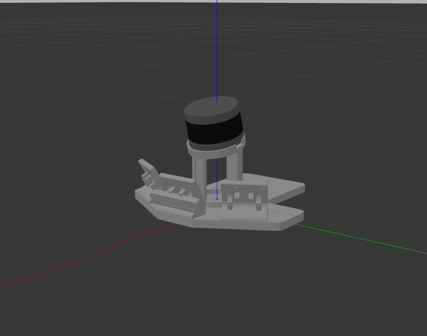
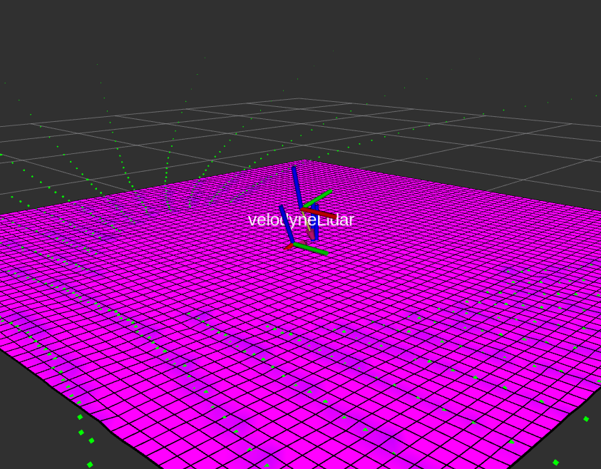
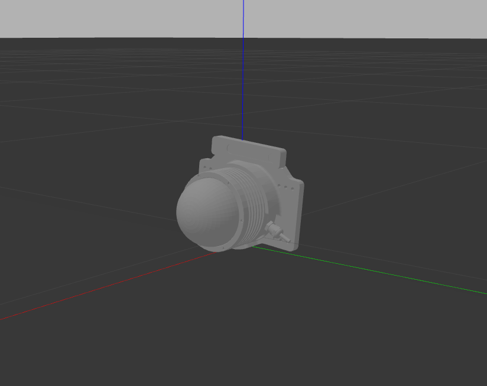
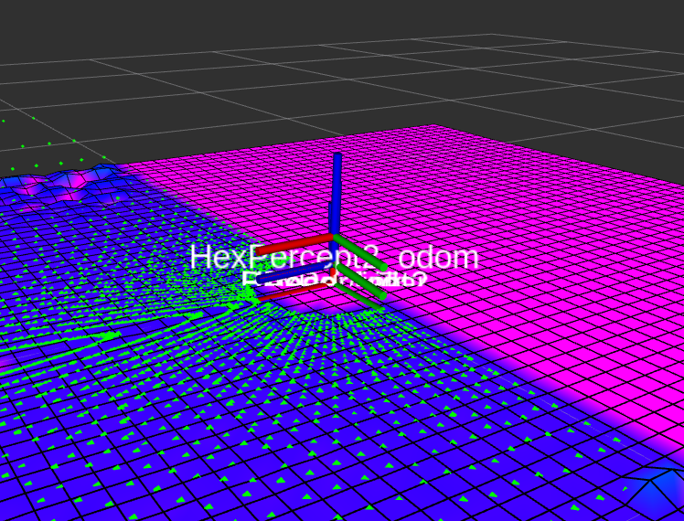

# HexapodElevationMapping

[English](README.md) | [中文](README_CN.md)

**用于机器人仿真和实际世界的传感器模块和高程映射捆绑包**。

---

## 传感器模块

### HexPercept1

<div style="display:flex; justify-content:center;">
    
    
</div>

HexPercept1 使用 **T265 作为惯性测量单元 (IMU)** 和 **Velodyne VLP-16 激光雷达作为测距传感器**。

### HexPercept2

<div style="display:flex; justify-content:center;">
    
    
</div>

HexPercept2 使用 **T265 作为惯性测量单元 (IMU)** 和 **RoboSense BPearl 激光雷达作为测距传感器**。

---

## 开箱使用

### 环境设置

首先创建一个 ROS 工作空间并克隆该存储库。

```bash
cd <your_workspace>/src
git clone --recursive https://github.com/MasterYip/HexapodElevationMapping
# 或 `git clone --recursive https://github.com/HITSME-HexLab/HexapodElevationMapping`
```

安装依赖项。

```bash
sudo apt install ros-$ROS_DISTRO-realsense2-camera ros-noetic-realsense2-description
```

Catkin 编译。

```bash
cd ../../
catkin_make -DCMAKE_BUILD_TYPE=Release
source devel/setup.bash
```

### 启动演示

选择一个传感器模块并启动演示。

```xml
<!-- HexPercept1 / HexPercept2 -->
<arg name="module_name" default="HexPercept1" />
```

```bash
roslauch hexapod_elevation_mapping demos.launch
```

---

## 用户指南

### 理解模块和模块接口

在 ROS 包 `hexapod_elevation_mapping` 中，传感器模块在 `model/modules` 文件夹中定义。每个模块都有自己的启动文件和配置文件。考虑到 **模块的可重用性**，我们尝试定义一个 **简单的模块接口**。

`model/modules/<module_name>` 文件夹中有几个文件：

- module.launch: 管理每个传感器模块的参数和启动节点，包括仿真和实际世界中的。
- example.xacro: demo.launch 使用的文件，用于在 gazebo 中仅生成模块。
- <module_name>.xacro: 模块的 Xacro 宏文件。
- <module_name>.rviz: 模块的 RViz 配置文件。
- 3D 模型文件: 模块的 3D 模型文件。

对于每个模块，**输入接口** 在 `module.launch` 中定义：

```xml
<arg name="module_name" default="HexPercept1"/>
<arg name="sim" default="true"/>
<arg name="module_installation_tf" default="0 0 0 0 0 0"/>
<arg name="base_frame_name" default="base_link"/>
<arg name="world_frame_name" default="world"/>
```

- module_name: 模块的名称。
- sim: 模块是否在仿真中还是在实际世界中。
- module_installation_tf: 从 base_link 到模块的变换。
- base_frame_name: 基本 tf 框架的名称。
- world_frame_name: 世界 tf 框架的名称。模块 odom 将发布一个从 `world` 到 `base` 的 tf。

**输出** 是高程映射节点将订阅的点云主题。主题名称在 `module.launch` 中定义。

### 在机器人上部署模块

1. 使用 `<module_name>.xacro` 在您的机器人 xacro 文件中定义模块。您可以使用 `example.xacro` 作为模板。
2. 复制 `demos.launch` 并修改相关参数，确保框架名称和主题名称正确。
3. 启动您的机器人（gazebo 或实际世界）。
4. 启动您刚刚创建的模块启动文件。

---

## 依赖项

Apt 安装

```bash
sudo apt install ros-$ROS_DISTRO-realsense2-camera ros-noetic-realsense2-description
```

Git 子模块

- [grid_map](https://github.com/ANYbotics/grid_map)
- [elevation_mapping](https://github.com/ANYbotics/elevation_mapping)
- [kindr](https://github.com/ANYbotics/kindr)
- [kindr_ros](https://github.com/ANYbotics/kindr_ros)
- [message_logger](https://github.com/ANYbotics/message_logger)
- [velodyne](https://github.com/ros-drivers/velodyne)
- [realsense_ros_gazebo](https://github.com/nilseuropa/realsense_ros_gazebo)
- [velodyne_simulator](https://bitbucket.org/DataspeedInc/velodyne_simulator.git)

## 致谢

特别感谢 [Tipriest](https://github.com/Tipriest) 提供的原始解决方案。

原始存储库:

- [Tipriest/ElevationMap](https://github.com/Tipriest/ElevationMap)
- [Tipriest/velodyne](https://github.com/Tipriest/velodyne)
- [Tipriest/kindr_ros](https://github.com/Tipriest/kindr_ros)
- [Tipriest/realsense_ros_gazebo](https://github.com/Tipriest/realsense_ros_gazebo)
- [Tipriest/realsense-ros](https://github.com/Tipriest/realsense-ros)
